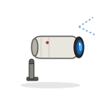

# Trama Network — Set Icone

Set di **19 icone isometriche** per dispositivi di rete, pensate per essere utilizzate su planimetrie 2D e diagrammi di topologia.

## Contenuto

### Infrastruttura
| File | Oggetto |
|------|---------|
| `rack.svg` | Rack (armadio di rete) |
| `patch_panel.svg` | Patch Panel |

### Networking
| File | Oggetto | Simbolo |
|------|---------|---------|
| `switch.svg` | Switch | Frecce incrociate (forwarding) |
| `router.svg` | Router | Nuvola (Internet/WAN) |
| `access_point.svg` | Access Point | Onde radio concentriche |
| `controller.svg` | Controller | Ingranaggio (management) |
| `media_converter.svg` | Media Converter | Connettore fibra ↔ RJ45 |

### Security
| File | Oggetto | Simbolo |
|------|---------|---------|
| `firewall.svg` | Firewall | Fiamma |

### Compute & Storage
| File | Oggetto | Simbolo |
|------|---------|---------|
| `server.svg` | Server | — |
| `nas.svg` | NAS | Cilindri hard disk |
| `kvm.svg` | KVM | Mini-monitor |

### Power
| File | Oggetto | Simbolo |
|------|---------|---------|
| `ups.svg` | UPS | Fulmine giallo |
| `pdu.svg` | PDU | Presa elettrica |

### Videosorveglianza ✨ NUOVO
| File | Oggetto | Simbolo |
|------|---------|---------|
| `telecamera.svg` | Telecamera bullet | Lente blu + cono visione |
| `nvr.svg` | NVR (Network Video Recorder) | REC rosso + play blu |

### Comunicazioni ✨ NUOVO
| File | Oggetto | Simbolo |
|------|---------|---------|
| `centralino.svg` | Centralino telefonico (PBX/VoIP) | Cornetta orizzontale blu |
| `citofono.svg` | Citofono | Casa verde |

### Controllo Accessi ✨ NUOVO
| File | Oggetto | Simbolo |
|------|---------|---------|
| `controllo_accessi.svg` | Terminale controllo accessi | Lucchetto giallo |

### Altro
| File | Oggetto | Simbolo |
|------|---------|---------|
| `generica.svg` | Generica | Punto interrogativo |

## Specifiche tecniche

- **Formato**: SVG vettoriale
- **ViewBox**: 128 × 128 px
- **Stile**: isometrico (vista 3/4), tratto sottile, palette grigia con accenti di colore per simboli identificativi
- **Compatibilità**: tutti i moderni browser, software di design (Figma, Sketch, Inkscape, Adobe Illustrator), e qualsiasi framework web (React, Vue, Angular)

## Come usarle

### In HTML
```html

```

### Inline (modificabili via CSS)
Apri il file SVG con un editor di testo, copia il contenuto `<svg>...</svg>` e incollalo direttamente nell'HTML. Da lì puoi cambiare colori o dimensioni con CSS.

### In React
```jsx
import TelecameraIcon from './icons/telecamera.svg';

```

### Esempio: componente generico per device

```jsx
const DEVICE_ICONS = {
  rack: '/icons/rack.svg',
  switch: '/icons/switch.svg',
  router: '/icons/router.svg',
  firewall: '/icons/firewall.svg',
  access_point: '/icons/access_point.svg',
  controller: '/icons/controller.svg',
  patch_panel: '/icons/patch_panel.svg',
  server: '/icons/server.svg',
  ups: '/icons/ups.svg',
  pdu: '/icons/pdu.svg',
  media_converter: '/icons/media_converter.svg',
  nas: '/icons/nas.svg',
  kvm: '/icons/kvm.svg',
  centralino: '/icons/centralino.svg',
  nvr: '/icons/nvr.svg',
  telecamera: '/icons/telecamera.svg',
  citofono: '/icons/citofono.svg',
  controllo_accessi: '/icons/controllo_accessi.svg',
  generica: '/icons/generica.svg',
};

function DeviceIcon({ type, size = 48 }) {
  const src = DEVICE_ICONS[type] || DEVICE_ICONS.generica;
  return ;
}
```

## Anteprima

Apri `anteprima.html` in un browser per vedere tutte le icone affiancate, organizzate per categoria, con uno slider per testarne la leggibilità a diverse dimensioni (da 24 px a 160 px). Le icone nuove sono evidenziate con un badge "NEW".

## Personalizzazione

Le icone sono SVG aperti, quindi puoi:
- Cambiare i colori modificando gli attributi `fill` e `stroke`
- Scalare a qualsiasi dimensione senza perdita di qualità
- Aggiungere classi CSS per gestire stati (es. `.offline { opacity: 0.4; }`)
- Animare singoli elementi via CSS o JavaScript
