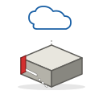

# Trama Network — Set Icone

Set di 14 icone isometriche per dispositivi di rete, pensate per essere utilizzate su planimetrie 2D e diagrammi di topologia.

## Contenuto

| File | Oggetto | Simbolo identificativo |
|------|---------|------------------------|
| `rack.svg` | Rack | (forma armadio) |
| `switch.svg` | Switch | Frecce incrociate (forwarding) |
| `router.svg` | Router | Nuvola (Internet/WAN) |
| `firewall.svg` | Firewall | Fiamma |
| `access_point.svg` | Access Point | Onde radio concentriche |
| `controller.svg` | Controller | Ingranaggio (management) |
| `patch_panel.svg` | Patch Panel | Griglia di connettori |
| `server.svg` | Server | (forma tower con drive bay) |
| `ups.svg` | UPS | Fulmine giallo |
| `pdu.svg` | PDU | Presa elettrica |
| `media_converter.svg` | Media Converter | Connettore fibra ↔ RJ45 |
| `nas.svg` | NAS | Cilindri hard disk impilati |
| `kvm.svg` | KVM | Mini-monitor con display |
| `generica.svg` | Generica | Punto interrogativo |

## Specifiche tecniche

- **Formato**: SVG vettoriale
- **ViewBox**: 128 × 128 px
- **Stile**: isometrico (vista 3/4), tratto sottile, palette grigia con accenti di colore per simboli identificativi
- **Compatibilità**: tutti i moderni browser, software di design (Figma, Sketch, Inkscape, Adobe Illustrator), e qualsiasi framework web (React, Vue, Angular)

## Come usarle

### In HTML
```html

```

### Inline (modificabili via CSS)
Apri il file SVG con un editor di testo, copia il contenuto `<svg>...</svg>` e incollalo direttamente nell'HTML. Da lì puoi cambiare colori o dimensioni con CSS.

### In React
```jsx
import RouterIcon from './icons/router.svg';

```

## Anteprima

Apri `anteprima.html` in un browser per vedere tutte le icone affiancate, con uno slider per testarne la leggibilità a diverse dimensioni (da 24 px a 160 px).

## Personalizzazione

Le icone sono SVG aperti, quindi puoi:
- Cambiare i colori modificando gli attributi `fill` e `stroke`
- Scalare a qualsiasi dimensione senza perdita di qualità
- Aggiungere classi CSS per gestire stati (es. `.offline { opacity: 0.4; }`)
- Animare singoli elementi via CSS o JavaScript
